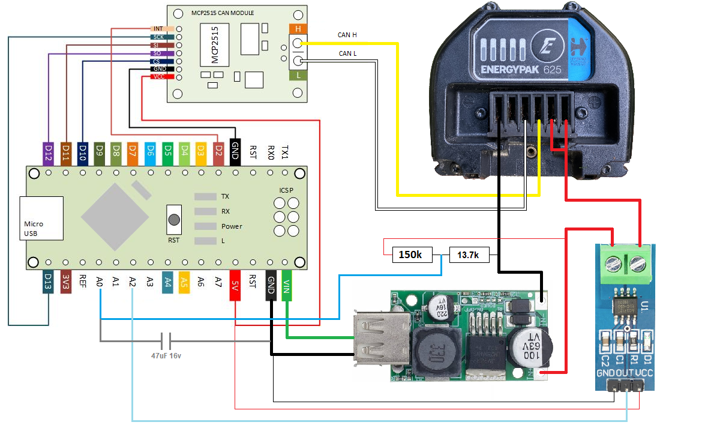

 First prototype to connect 3rd party battery instead of Giant EnergyPak.

 
 
 
 Arduino + MCP2515 send proper data to the controller via CAN BUS protocol.
 Most of data are hard coded, but they are not necessary to operate ebike. The most important is reading battery level and it's working quite ok, but need to be optimized.

 
 Whole system in sleep mode consumes approximately 5.5 mA after removed pwr LEDs, of which approximately 4.5 mA is consumed by the DC/DC converter.
